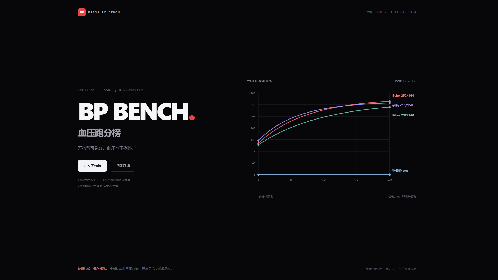
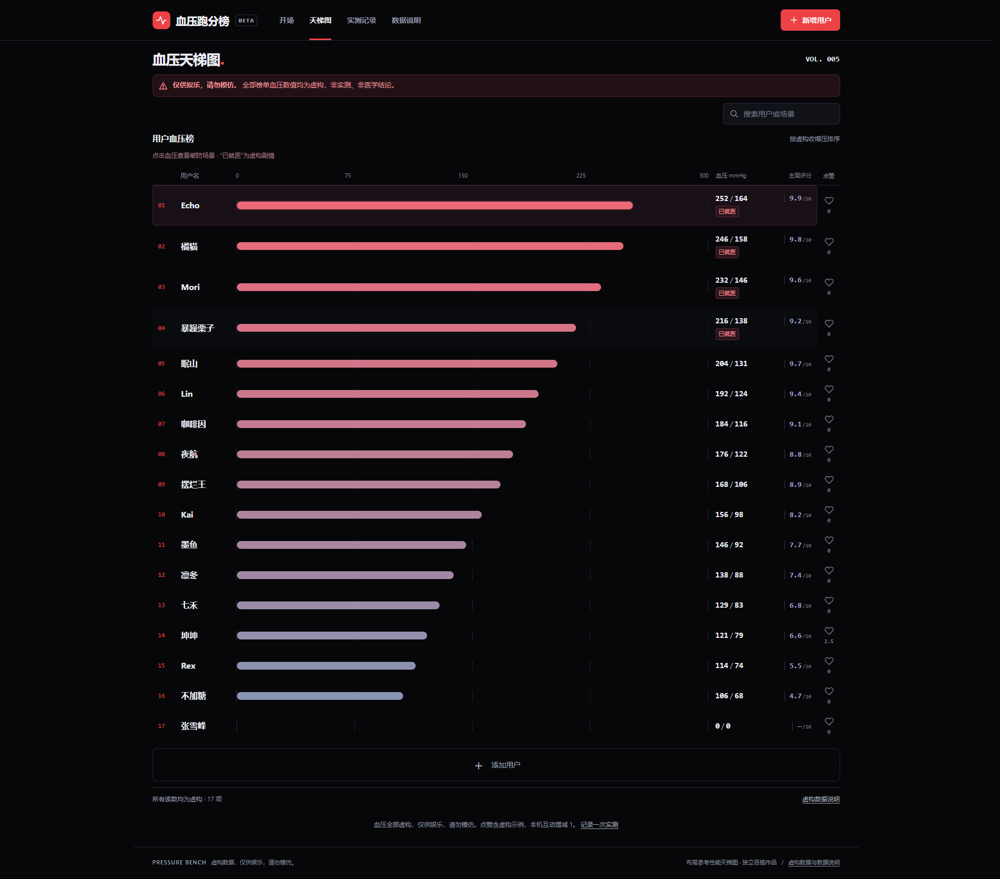

# 血压跑分榜

万物皆可跑分，血压也不例外。

一个使用虚构血压数据的独立恶搞网站，附带可自行后期配音的无声演示视频。

## 使用

下载仓库或发布包，直接用浏览器打开根目录的 `index.html`。页面使用原生 HTML、CSS、JavaScript，无需安装依赖或启动服务，离线可用。

## 网页功能

- 深色首页，前三名函数曲线和张雪峰的零值曲线；进入榜单时曲线过渡到横柱状图。
- 显示完整榜单，横条颜色略有不同。前四名显示“已就医”。
- 点击血压数值查看破防场景，旁边的点赞按钮独立互动，主观评分独立填写。
- 演示昵称“坤坤”的起始点赞数为 2.5；“张雪峰”的虚构读数为 0/0，虚构场景为跑步。
- 榜单底部的 ＋ 支持新增用户；详情支持修改和删除，预置用户也可编辑。
- 支持本机个人实测记录、PNG 分享卡和 CSV 导出，个人实测不进入虚构榜单。
- 适配手机与桌面，并尊重系统的“减少动态效果”设置。

普通用户名支持中文最多 4 字、英文最多 12 个字符。虚构血压按收缩压排序，同值再按舒张压排序，“已就医”跟随完整榜单前四名更新。

## 无声视频

[下载最终版视频](https://github.com/jinyiliulang-a11y/blood-pressure-bench/releases/download/v1.0.0/blood-pressure-bench-silent-final-1080p60.mp4)

[下载完整离线发布包（含网页和视频）](https://github.com/jinyiliulang-a11y/blood-pressure-bench/releases/download/v1.0.0/blood-pressure-bench-github.zip)。解压完整发布包后，视频位于 `media/blood-pressure-bench-silent-final-1080p60.mp4`。

- 41 秒，1920×1080，60 帧/秒，H.264 MP4。
- 完全没有音轨，可自行添加配乐和音效。
- 开场全景后聚焦张雪峰的 0/0 曲线，包含坤坤的 2.5 赞、“已就医”标签特写和连续推近、横移、退镜。
- 以“下一位，会是谁？”和榜单 ＋ 收尾，再显示 5 秒免责声明。

## 页面预览

## 数据保存

用户新增、修改、删除、点赞和个人实测仅保存在当前浏览器的 `localStorage`，不上传服务器、不接入健康平台，也不提供公共点赞计数或跨设备同步。每次点赞在本机增加 1，取消点赞减去 1。

清除浏览器数据会删除本机记录。“重置本机演示”恢复初始榜单，并清除本机互动与实测记录；需要保留实测记录时请先导出。

## 免责声明

本作品为恶搞演示，血压数值、示例点赞数与剧情均为虚构。演示昵称不代表本人健康状况或真实经历。“已就医”仅为虚构剧情标签，0/0 为虚构彩蛋，不代表真实血压或就诊情况。

本内容不构成医疗建议。仅供娱乐，请勿模仿。

图形表达参考极客湾的性能天梯图，转场表达参考 Apple 网站；本作品与极客湾及 Apple 无关联。
